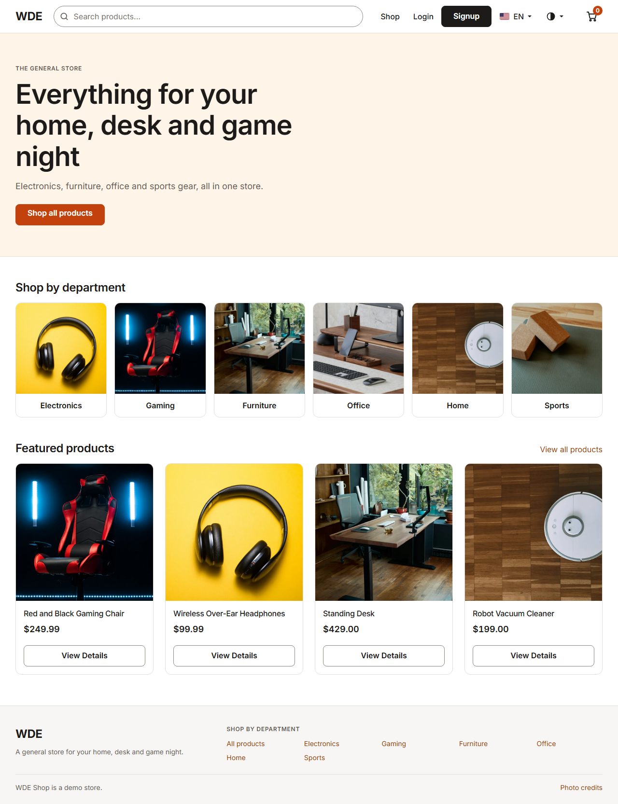
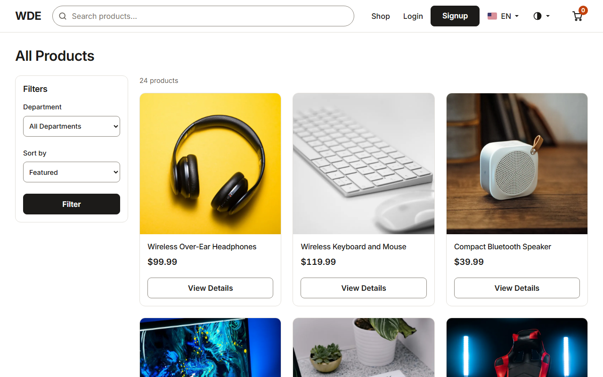
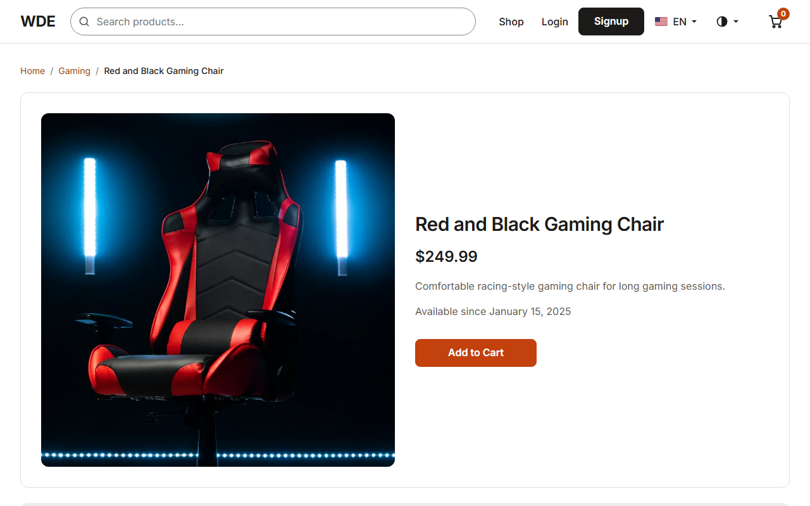
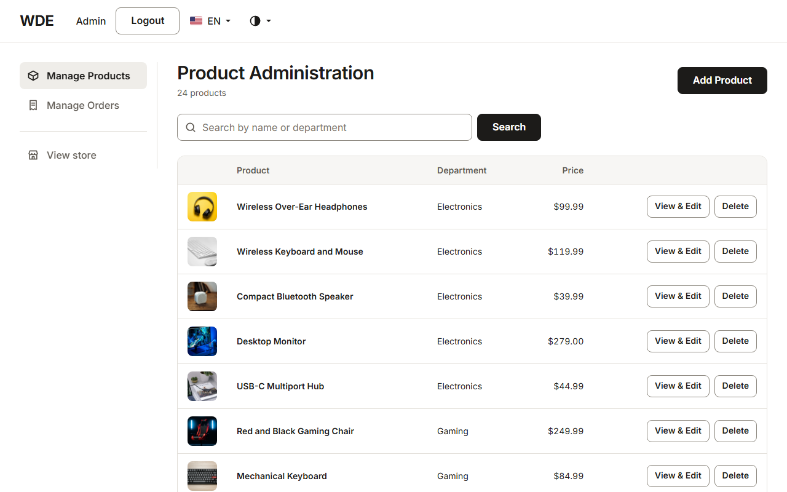
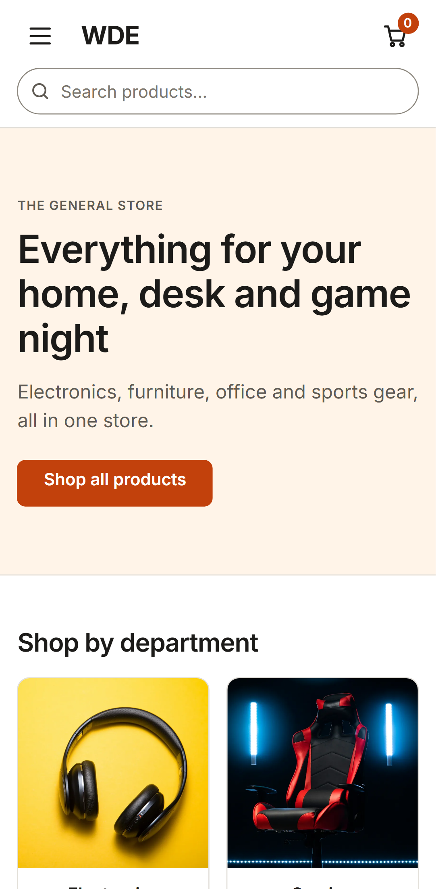
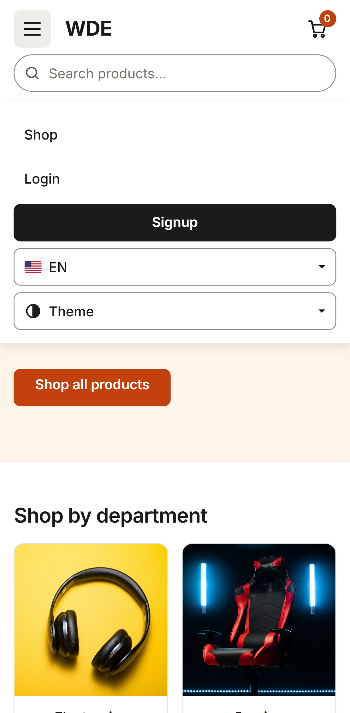

<h1 align="center">WDE Shop: Playwright + TypeScript test suite</h1>

<p align="center">
  End-to-end, security, visual-regression, responsive and accessibility tests for the
  <a href="https://github.com/Gabriel-Leao51/wde">WDE Shop</a> demo store, written with
  Playwright Test and strict TypeScript. The same suite was the safety net for a full redesign of the app.
</p>

<p align="center">
  <a href="https://github.com/Gabriel-Leao51/wde-playwright-ts/actions/workflows/ci.yml"></a>
  
  
  
</p>

<p align="center">
  
</p>

## What this is

[`wde`](https://github.com/Gabriel-Leao51/wde) is an Express, EJS and MongoDB store with a customer side (catalog, cart, Stripe test checkout, orders and PDF invoices, password or emailed one-time-code login) and an admin side (product CRUD, orders table). This repo tests it from the outside, in a real browser.

It started as a port of an earlier Python suite ([`wde-test-automation`](https://github.com/Gabriel-Leao51/wde-test-automation), pytest-bdd, now frozen), reaching scenario-by-scenario parity with its 45 scenarios. It then guarded a redesign of the whole app: 16 sessions of CSS and markup changes, light and dark themes, phone layouts, and accessibility fixes, with the suite telling me what each change broke. The story is in [`docs/what-i-built.md`](docs/what-i-built.md).

## What is covered

| Area                    | Spec files                                                                                              | What is checked                                                                                                     |
| ----------------------- | ------------------------------------------------------------------------------------------------------- | ------------------------------------------------------------------------------------------------------------------- |
| Auth and access control | `admin-login`, `admin-panel-protection`, `otp-login`, `auth-forms`                                      | Password and emailed-code login, 401/403 on admin routes, inline validation                                         |
| Shopping flow           | `cart`, `purchase-flow`, `catalog-filter-sort`, `catalog-sidebar`, `product-details`, `product-pricing` | Filters, sorting, search suggestions, quantity and removal, a real Stripe test-mode checkout plus the Mailpit email |
| Orders                  | `customer-orders`, `manage-orders`, `order-invoice`                                                     | Order cards and badges, admin status updates and sorting, invoice PDF download                                      |
| Admin                   | `product-crud`, `admin-layout`, `admin-dashboard`, `admin-search`                                       | Add, edit, delete with rich text, date picker and drag-and-drop upload; sidebar shell and tables                    |
| Security                | `security-hardening`                                                                                    | NoSQL injection, forged session cookie, missing headers, CSRF handling; known bugs are `test.fail()`                |
| Look and feel           | `visual-regression`, `theme`, `home`, `header`, `product-cards`, `page-spacing`, `error-toast-modal`    | 98 screenshot baselines in light and dark, theme menu and cookie, layout measured from rendered boxes               |
| Responsive              | `responsive` (phone projects only)                                                                      | No horizontal overflow on 15 pages, 44px touch targets, 16px inputs, tap-only shopping flow                         |
| Accessibility           | `accessibility`                                                                                         | axe-core WCAG 2.0/2.1/2.2 A and AA scans on every page, in both themes, plus menus, toast and modal                 |
| Language                | `language-selector`                                                                                     | English and Portuguese, including product titles                                                                    |

255 tests run on each of Chromium, Firefox and WebKit, and 28 on each of Pixel 7 and iPhone 15 emulation (813 runs in total, including the login setup).

## How it is built

- **Role and label locators only.** `getByRole`, `getByLabel`, `getByText`. No CSS, XPath or test ids. `eslint-plugin-playwright` enforces this (and bans `waitForTimeout`) as errors, so the rule cannot rot. This is what let the redesign rewrite every page's markup without a rewrite of the tests.
- **Page objects hold locators and actions; tests hold assertions.** Page objects are injected as fixtures (`fixtures/index.ts`), so a spec asks for `productsPage` and gets one.
- **Log in once per role.** A `setup` project saves `storageState` for each role; a test opts in with `test.use({ loggedInAs: 'admin' })`. Tests that change the server-side session (cart, language, logout) log in fresh instead.
- **Typed test data and clients.** Users come from `test-data/users.json`; `lib/mongo.ts` reads the database directly where a UI check would duplicate the seed data; `lib/mailpit.ts` polls the mail catcher with `expect.poll` instead of sleeping.
- **Known bugs are documented, not hidden.** A scenario that asserts the secure behaviour and currently fails is marked `test.fail()`, so the run stays green and flips red the day the bug is fixed.
- **Visual baselines come from Linux only.** `toHaveScreenshot()` baselines are generated inside the `mcr.microsoft.com/playwright` Docker image so they match CI (`ubuntu-latest`). On Windows those specs fail by design (no `-win32` baselines).
- **Strict TypeScript, ESLint and Prettier** gate every commit through `npm run check`.

```
tests/        specs, plus *-snapshots/ baselines
pages/        page objects (cart, login, orders, products, header, footer, home, Stripe, OTP)
fixtures/     test.extend: page objects, setLanguage, loggedInAs
lib/          axe, mailpit and mongo helpers
test-data/    typed users
docs/         write-up, screenshots and the script that captures them
```

## Running it

You need Node 22 and Docker. The app under test is the sibling repo `wde`:

```bash
git clone https://github.com/Gabriel-Leao51/wde.git ../wde
cd ../wde
cp .env.example .env        # put a Stripe test key (sk_test_...) in STRIPE_KEY
docker compose up --build   # app :3000, MongoDB :27017, Mailpit :8025
```

Then, from this repo:

```bash
npm ci
npx playwright install --with-deps
npm test                                  # all projects
npx playwright test --project=chromium    # one project
npm run check                             # typecheck + lint + format check
```

Point the suite at another instance with `WDE_BASE_URL`. To reset the data, run `docker compose down -v && docker compose up --build` in `wde`.

On Windows, the visual-regression specs fail because their baselines are Linux-only; run them in the Playwright image or read the CI result instead.

## CI

[`ci.yml`](.github/workflows/ci.yml) checks out this repo and `wde`, brings the stack up with Docker Compose, waits for the app, and runs one job per project: Chromium, Firefox, WebKit, Pixel 7 and iPhone 15. Each job uploads its HTML report as an artifact, and failures dump the app logs. One scenario is skipped on WebKit in CI only: Stripe's own bot protection blocks that browser from GitHub's shared IPs, while the test passes locally.

## The redesigned app

<p align="center">
  
  
</p>
<p align="center">
  
  
</p>
<p align="center">
  
  
</p>
<p align="center">
  
  
</p>

Regenerate these with the stack running: `node docs/capture-screenshots.mjs docs/screenshots`.

## Planning

The session-by-session plan, decisions and progress log are in [`ROADMAP.md`](ROADMAP.md).
